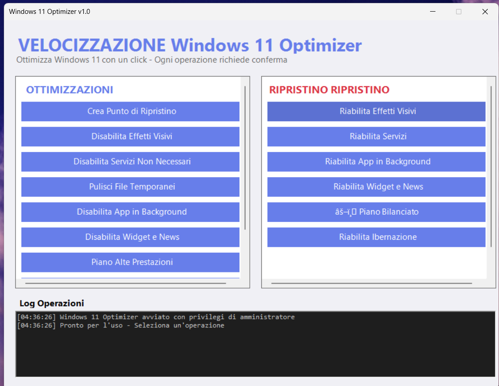

# 🚀 Windows 11 Optimizer - Applicazione Portatile


> Un'applicazione portatile con interfaccia grafica per ottimizzare Windows 11 in modo semplice e sicuro.

---

## 📋 Descrizione

Windows 11 Optimizer è un'applicazione portatile che permette di ottimizzare Windows 11 con un'interfaccia grafica intuitiva.



### ✨ Caratteristiche

- ✅ Interfaccia grafica minimale e intuitiva
- ✅ Richiede conferma per ogni operazione
- ✅ Log dettagliato di tutte le operazioni
- ✅ Possibilità di ripristinare ogni modifica
- ✅ Non richiede installazione (portabile)
- ✅ Richiede privilegi di amministratore

---

## 🚀 Come Usare l'Applicazione

### Metodo 1 - Avvio Rapido (Consigliato)

1. Fai doppio click su `Avvia_Optimizer.bat`
2. Conferma l'elevazione dei privilegi (UAC)
3. L'applicazione si avvierà automaticamente

### Metodo 2 - Avvio Manuale

1. Fai click destro su `Windows11_Optimizer.ps1`
2. Seleziona "Esegui con PowerShell"
3. Se richiesto, conferma l'esecuzione
4. L'applicazione richiederà automaticamente i privilegi di amministratore

---

## 🎯 Funzionalità Disponibili

### 🔧 Sezione Ottimizzazioni (Pannello Sinistro)

| Funzione | Descrizione |
|----------|-------------|
| **Crea Punto di Ripristino** | Crea un backup del sistema |
| **Disabilita Effetti Visivi** | Rimuove animazioni e trasparenze |
| **Disabilita Servizi Non Necessari** | Disattiva servizi che consumano risorse |
| **Pulisci File Temporanei** | Elimina file temp, cache e cestino |
| **Disabilita App in Background** | Impedisce alle app di girare in background |
| **Disabilita Widget e News** | Rimuove widget dalla barra delle applicazioni |
| **Piano Alte Prestazioni** | Massime prestazioni (consuma più energia) |
| **Disabilita Ibernazione** | Libera spazio su disco |
| **OTTIMIZZAZIONE COMPLETA** | Applica tutte le ottimizzazioni insieme |

### ↩️ Sezione Ripristino (Pannello Destro)

| Funzione | Descrizione |
|----------|-------------|
| **Riabilita Effetti Visivi** | Ripristina animazioni e trasparenze |
| **Riabilita Servizi** | Riattiva i servizi disabilitati |
| **Riabilita App in Background** | Permette alle app di girare in background |
| **Riabilita Widget e News** | Ripristina i widget |
| **Piano Bilanciato** | Equilibrio tra prestazioni e consumo |
| **Riabilita Ibernazione** | Riattiva l'ibernazione |
| **RIPRISTINO COMPLETO** | Annulla tutte le ottimizzazioni |

---

## ⚙️ Funzionamento

### 1. 🔔 Conferma Richiesta
Ogni operazione richiede la tua conferma esplicita prima di procedere. Puoi sempre annullare cliccando "No".

### 2. 📊 Log Operazioni
Tutte le azioni vengono registrate nel log in basso. Il log mostra:
- ⏰ Timestamp di ogni operazione
- ✅ Stato di completamento (✓ successo, ✗ errore, ⚠ warning)
- 📝 Eventuali messaggi di errore

### 3. 🔔 Notifiche
Al completamento di ogni operazione riceverai una notifica che conferma il successo o segnala eventuali errori.

---

## ⚠️ Raccomandazioni Importanti

### ✅ Prima di Iniziare

- ✅ **CREA UN PUNTO DI RIPRISTINO** usando il pulsante dedicato
- ✅ Chiudi tutte le applicazioni aperte
- ✅ Salva il tuo lavoro
- ✅ Leggi le descrizioni delle operazioni prima di confermare

### ✅ Dopo l'Ottimizzazione

- ✅ Riavvia il computer per applicare tutte le modifiche
- ✅ Verifica che tutto funzioni correttamente
- ✅ Se qualcosa non va, usa i pulsanti di **RIPRISTINO**

### ❌ Non Consigliato

- ❌ Non usare su laptop l'opzione "Alte Prestazioni" (consuma batteria)
- ❌ Non disabilitare servizi se non sei sicuro di cosa facciano
- ❌ Non applicare l'ottimizzazione completa senza sapere cosa fa

---

## 🔧 Troubleshooting

### ❓ "Impossibile eseguire script su questo sistema"

**Soluzione:** Apri PowerShell come amministratore e digita:
```powershell
