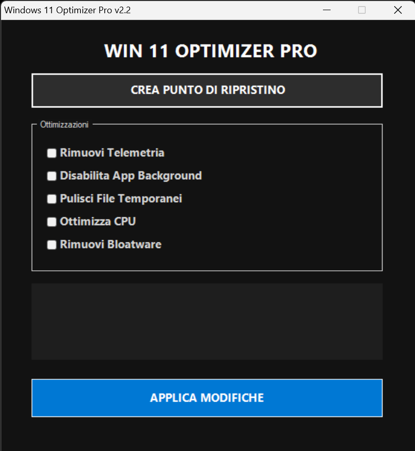

# 🚀 Windows 11 Optimizer Pro

Utility professionale e leggera per ottimizzare Windows 11, migliorare la privacy e rimuovere il bloatware di sistema.

## ✨ Caratteristiche Principali
- **Interfaccia Dark Moderna**: Design pulito e intuitivo in Dark Mode.
- **Esecuzione Sicura**: Richiede automaticamente i permessi di Amministratore (UAC Shield).
- **Console di Log Integrata**: Monitora in tempo reale ogni modifica effettuata.
- **Personalizzazione**: Scegli esattamente quali ottimizzazioni applicare tramite checkbox.
- **Portable**: Un unico file .exe che non necessita di installazione.

## 🛠 Come si usa
1. Scarica l'ultima versione da [Releases](../../releases).
2. Avvia Win11Optimizer_Pro.exe come amministratore.
3. Seleziona le ottimizzazioni desiderate e clicca su **APPLICA MODIFICHE**.

## 📄 Licenza
Distribuito sotto licenza MIT. Vedi LICENSE.txt per maggiori dettagli.

---
*Sviluppato con ❤️ da [ilnanny75](https://github.com/ilnanny75)*
